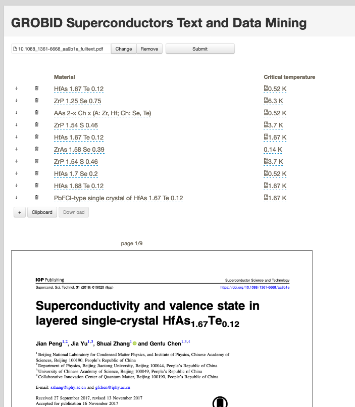

# Supercuration
Supercuration (Superconductors Curation) is an interface based on [Grobid Superconductor](https://github.com/lfoppiano/grobid-superconductors) 
which allows extraction and visualisation of material and properties from Superconductors-related papers. 

Grobid-superconductors provides a basic interface that allows extraction of entities such as `material`, `superconducting critical temperature`, etc.. 
This interface adds apply a simple linking algorithm to the extracted entities. 

The interface provides a visualisation of the extracted tabular information (material - tc), and the ability to:
  - scroll automatically to the relative part of the document
  - correct the extracted information in the interface     
 

By clicking on each annotation in the text, is possible to see the details (for the moment just the supscript/superscript formatting and the Critical temperature):  

## Gettings started

We recommend to use CONDA 

> conda create -n supercuration pip python=3.7 
> conda activate supercuration

check that pip is the correct one in the conda environment: 

> which pip 

(pip should come from `.envs/supercuration/bin/pip` or something like that. In negative case, and eventually unset it 

> unset pip 
 
Install the dependencies: 

> conda install gensim flask BeautifulSoup4 

> pip install scispacy 

(check http://github.com/allenai/scispacy on how to install the latest small models)
Then we need to install the local dependencies: 

> pip install -e commons 
> pip install -e linking

then you're ready to go 

> cd supercuration
> export FLASK_APP=controller.py
> flask run  
